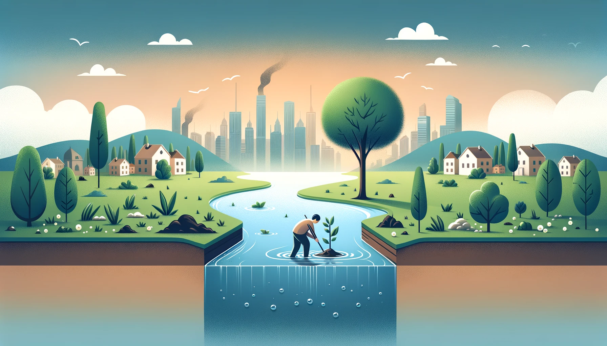

# Conclusion

En conclusión, los problemas ambientales y sociales que enfrentamos hoy en día son complejos y están interrelacionados, y su impacto negativo se refleja tanto en el medio ambiente como en la calidad de vida de las personas, especialmente las más vulnerables. 

La sobrepoblación, el consumo desmedido de recursos, la desigualdad en el acceso a servicios básicos como agua, salud y educación, y el cambio climático son algunos de los retos más urgentes. 

A pesar de la magnitud de estos problemas, existen diversas acciones y medidas que pueden tomarse tanto a nivel global como local para mitigar sus efectos y promover un desarrollo más equitativo y sostenible. 
Es esencial que gobiernos, empresas y ciudadanos trabajen juntos para implementar soluciones eficaces que promuevan la justicia social y la protección del medio ambiente, asegurando un futuro más justo y equilibrado para las generaciones venideras.

---

---
