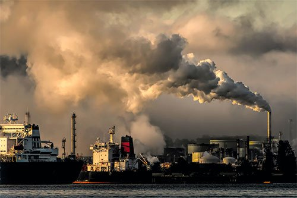

# 1.3 Impacto de los actuales problemas medioambientales.
## Hablaremos de los 10 principales problemas medioambientales del mundo:
## 1. Calentamiento global
Las temperaturas medias del planeta cada vez son mayores, esto se debe principalmente a las emisiones de co2, gases del efecto invernadero
## 2. Contaminación

Segun la OMS el 90% de la humanidad respira aire contaminado, pero no solo se contamina el aire tambien el agua y la tierra.
* Aire: Si reducieramos la polución la cantidad de enfermedades respiratorias caeria drasticamente. El aire contaminado es motivo de 7 millones de muertes al año.
* Mar/agua: La contaminacion de las aguas tambien acarrea grandes problemas de salud.
  Eliminar los vertidos a rios/mares, y reducir el uso de quimicos contaminantes serian buenas soluciones.
* Tierra: El deterioro del suelo en el planeta se debe a varios factores, como la salinización, la erosión y la contaminación química.
  La FAO distingue dos tipos de contaminación:
   * La puntual: que ocurre en lugares específicos como ciudades o fábricas sin control.
   * La difusa: que afecta áreas más amplias y es más difícil de rastrear, impactando tanto el aire, el agua como la tierra y causando mayores daños al medioambiente.
## 3. Deforestacion:
* El problema de la deforestacion afecta principalmente a Africa y America del sur debido a que no tienen una gran agricultura, realizan una gran sobreexplotacion de la industria de la madera
## 4. Pérdida de biodiversidad:
* La pérdida de biodiversidad está provocada por varios factores, siendo el principal la destrucción de los hábitats de las especies, que ocurre cuando se transforman en tierras para agricultura, ganadería o urbanización.
  Esto ha llevado a que el 8% de las especies animales ya se hayan extinguido y el 22% esté en peligro. Es importante proteger los espacios naturales con leyes y concienciar a la gente sobre la importancia de cuidar la biodiversidad.
## 5. Sequía:
* Las temperaturas han subido en las últimas décadas, lo que ha provocado un aumento en los eventos climáticos extremos como olas de calor, huracanes y sequías. Estos fenómenos cada vez son más frecuentes y severos.
  Es crucial frenar el aumento de las temperaturas para reducir estos desastres, pero también debemos adaptarnos y estar preparados para enfrentarlos cuando ocurran.
## 6. Consumo abusivo: 
* La obsolescencia programada, cuando los aparatos electrónicos se diseñan para dejar de funcionar después de cierto tiempo, contribuye a problemas medioambientales.
  Esto hace que tengamos que comprar constantemente productos nuevos, lo que aumenta el uso de materiales y la generación de residuos.
  Además, si no se gestionan bien, los residuos electrónicos pueden ser peligrosos para el medioambiente.
## 7. Residuos:
* A medida que la población mundial crece y consumimos más, también aumentan los residuos que generamos. La economía circular puede ayudarnos a evitar una crisis, promoviendo la reducción, el reciclaje y la reutilización de los materiales.
## 8. Superpoblación.
Según la ONU, en menos de diez años seremos más de 8.500 millones de personas en el planeta. Esto no solo incrementará la cantidad de residuos, sino también la explotación de materias primas, que no son infinitas. Por eso, es clave gestionar los recursos de manera responsable si queremos asegurar nuestra supervivencia.
## 9. Invasion y tráfico ilegal de especies
* El tráfico ilegal de especies no solo es devastador para los animales, sino también para el medioambiente, ya que puede introducir especies invasoras o enfermedades que alteren ecosistemas enteros.
Para combatirlo quizas deberiamos implementar leyes más estrictas, y quizas educar mejor a la poblacion respecto a estos temas.
## 10. Desconexión social
No vivimos aislados, somos parte de una sociedad y, aunque no somos los únicos responsables del estado del medioambiente, no podemos solucionarlo por nuestra cuenta. El voluntariado y el activismo medioambiental son fundamentales ahora más que nunca. Una buena forma de involucrarse y hacer frente a esta desconexión es unirse a iniciativas  o incluso crear una propia.
