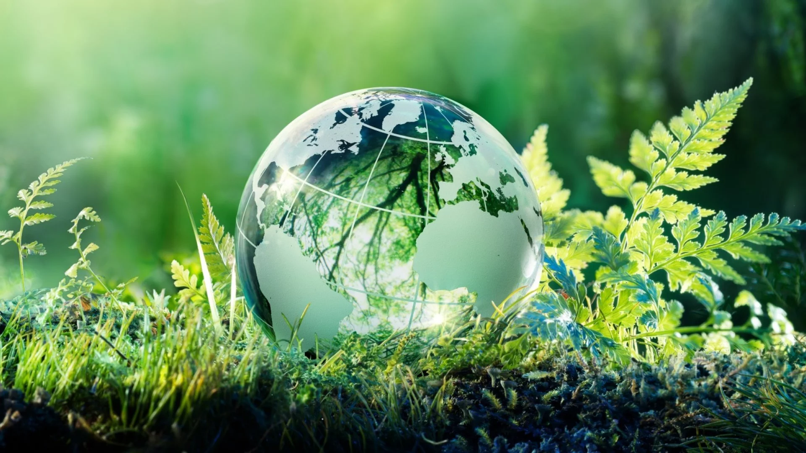

# Introducción

Hoy en día, los problemas ambientales y sociales son algunas de las mayores preocupaciones globales. La degradación del medio ambiente y las crecientes desigualdades están fuertemente conectadas, lo que genera una gran incertidumbre sobre el futuro. El cambio climático, la deforestación, la pérdida de biodiversidad, la contaminación y la crisis del agua son solo algunos de los desafíos más urgentes que enfrentamos. Estos no solo afectan al medio ambiente, sino que también empeoran la pobreza, la migración forzada y el acceso desigual a recursos básicos como el agua y la salud.

Los efectos de estos problemas se ven en fenómenos como desastres naturales más frecuentes, la extinción de especies y la alteración de los ecosistemas, que impactan principalmente a las poblaciones más vulnerables. Ante esta realidad, es fundamental explorar qué acciones se están tomando a nivel global y local para mitigar estos efectos. Este proyecto busca analizar estos problemas de manera integral, proponiendo soluciones viables para reducir sus impactos y fomentar un equilibrio entre el desarrollo social y la protección del medio ambiente.
