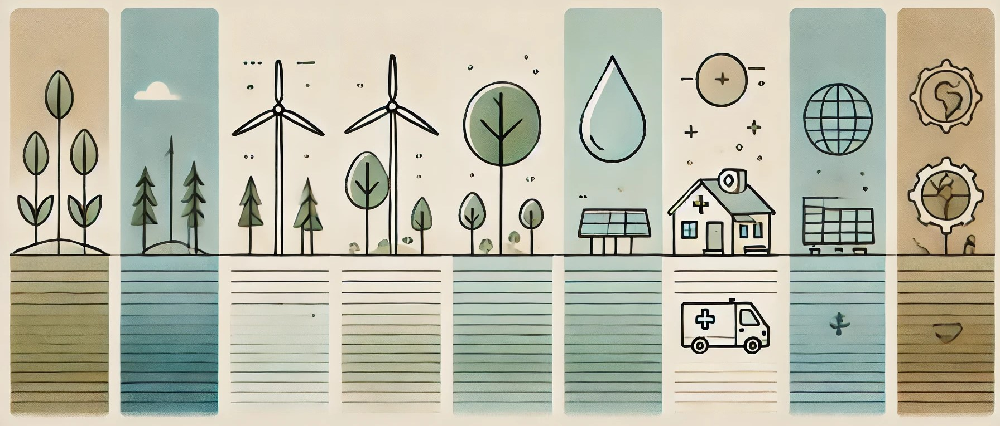

# Medidas y acciones medioambientales

Por ultimo hablaremos sobre que medidas se toman o se pueden tomar en la actualidad para hacer frente a algunos de los problemas anteriormente mencionados.

---
### **Desigualdad y pobreza**
1.   **Programas sociales**: Transferencias directas, subsidios y redes de protección social para apoyar a los más vulnerables.
2.   **Fomento del empleo**: Políticas para generar empleo digno, como inversiones en sectores productivos y apoyo a pequeñas empresas.
3.   **Educación y capacitación**: Promoción de acceso igualitario a la educación y programas de formación para mejorar la empleabilidad.
4.   **Redistribución fiscal**: Sistemas de impuestos progresivos y gasto público enfocado en servicios esenciales.

### **El consumo de agua**
1.   **Campañas de concienciación**: Promoción del uso responsable del agua a nivel doméstico, agrícola e industrial.
2.   **Infraestructura mejorada**: Inversiones en sistemas de distribución para evitar fugas y reducir el desperdicio.
3.   **Regulación del uso**: Políticas para controlar la explotación excesiva de fuentes hídricas, priorizando usos esenciales.

### **La sobrepoblación**
1.   **Educación sexual y planificación familiar**: Ampliación del acceso a métodos anticonceptivos y programas educativos sobre reproducción.
2.   **Desarrollo sostenible**: Fomentar un crecimiento económico equilibrado que no dependa de la expansión demográfica.
3.   **Urbanismo planificado**: Diseñar ciudades que puedan acomodar a una población creciente sin degradar los recursos naturales.

### **Acceso inequitativo a la educación y salud**
1.   **Inversión en infraestructura**: Construcción de escuelas, hospitales y centros de atención en zonas marginadas.
2.   **Subsidios y becas**: Apoyo económico para facilitar el acceso a servicios educativos y de salud.
3.   **Cobertura universal**: Sistemas de salud y educación que prioricen la gratuidad o bajos costos para los grupos más vulnerables.
4.   **Capacitación y distribución equitativa**: Formación de maestros y médicos, y su distribución en regiones rurales o desatendidas.
