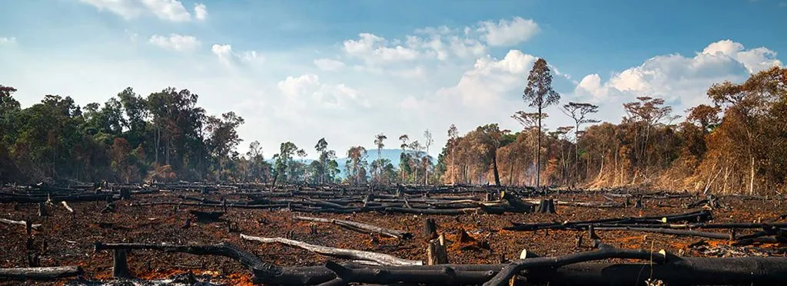

# Principales retos ambientales y sociales

En este documento hablaremos sobre cuales son los principales retos ambientales y sociales, y como afectan a dia de hoy a nuestras vidas y a el mundo en el que vivimos.
En la actualidad, el Planeta Tierra está sometido a cambios y desafíos sin precedentes.

El actual modelo de desarrollo, las actividades de la sociedad moderna y el enorme crecimiento demográfico (la población mundial se ha multiplicado por más de cinco en menos de cien años), están generando una demanda cada vez mayor de recursos naturales y están incrementando los impactos directos e indirectos sobre los ecosistemas. 

## La sobrepoblacion

Hablamos de sobrepoblacion en una region o zona cuando los recursos son insuficientes o no llegan a todos los individuos nque necesitan de esos recursos. La sobrepoblacion es un problema en muchos paises donde cada vez la produccion energetica, por ejemplo, es insuficiente, al igual que otras necesidades como la comida o el agua potable.

Eñ principal problema de la sobrepoblacion es el consumo desigual y desmedido de los recursos, pues, al final, el planeta tiene una capacidad limitada en cuanto a generacion de materia prima.

## El consumo de agua

A dia de hoy el agua potable en el mundo es, en teoria, suficiente para dar de beber a todos en el mundo. Entonces podria parecer que no existe un problema real, pero cuando gablamos del excesivo consumo del agua nos referimos mas bien a su distribucion tan desigual.

  Al igual que con la comida, el agua es un recurso abundante pero mal distribuido, siendo que mientras en el primer mundo tenemos tanta agua potable que hasta nos podemos permitir desperdiciarla activamente, en paises y continentes mas desfavorecido el agua potable es mas valiosa que el oro.

  Hoy dia los paises donde mas consumo de agua hay son la India, China y EE.UU.

## Desigualdad y pobreza

La **desigualdad** es la distribución desigual de recursos y oportunidades, mientras que la **pobreza** es la falta de lo necesario para cubrir necesidades básicas. Ambas están interconectadas: la desigualdad amplía las brechas sociales y limita las posibilidades de quienes viven en pobreza, perpetuando su situación. 

Estas problemáticas afectan el desarrollo económico y la cohesión social. Superarlas requiere políticas inclusivas que reduzcan las brechas, inviertan en servicios básicos y promuevan igualdad de oportunidades para todos.

## Acceso inequitativo a la educacion y salud

El acceso inequitativo a la educación se refleja en diferencias en la calidad de escuelas, tasas de deserción y oportunidades según ingresos, género o ubicación. Estas desigualdades limitan la movilidad social y perpetúan la pobreza, especialmente en comunidades vulnerables.

En salud, las inequidades se ven en la falta de acceso a servicios básicos y atención de calidad, afectando principalmente a los grupos desfavorecidos. La relación entre educación y salud es clave: una educación limitada dificulta el acceso a prácticas saludables, y la mala salud reduce oportunidades educativas y económicas. Superar estas barreras requiere políticas que garanticen igualdad de acceso a ambos derechos fundamentales.

## Generación de desechos

La generación de desechos es un desafío ambiental que contamina suelo, agua y aire, afectando ecosistemas y salud pública. El aumento de residuos no biodegradables, como plásticos, agrava la crisis ambiental. En España, por ejemplo, la generacion de basura es de 1,2kg (aprox) de basura al dia por persona, una cifra que pese a ser grande siguen situandose en la media europea.

Abordarlo requiere prácticas sostenibles, como reducir, reutilizar y reciclar, junto con políticas de economía circular que minimicen residuos y promuevan la reutilización.

## Contaminación lumínica

La contaminación lumínica es el exceso de luz artificial que afecta el cielo nocturno, altera ecosistemas y perjudica la salud humana. Proviene de iluminación mal diseñada, como farolas y anuncios luminosos, que interrumpen ritmos naturales y desconectan de la naturaleza.

Reducirla implica usar iluminación eficiente, horarios de apagado y tecnologías menos invasivas para proteger el medio ambiente y la calidad de vida.
